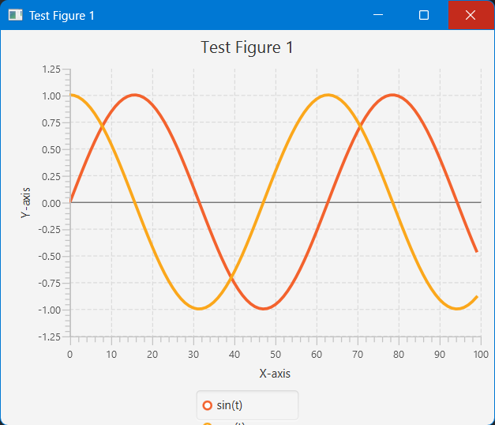
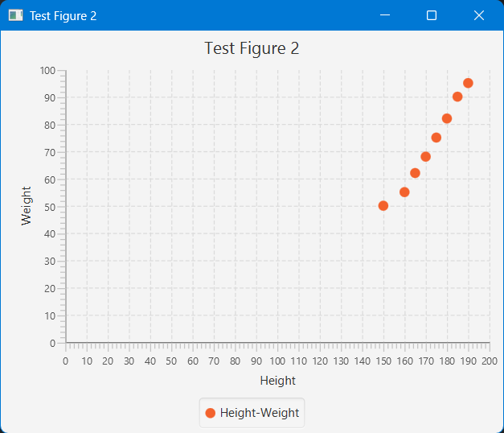
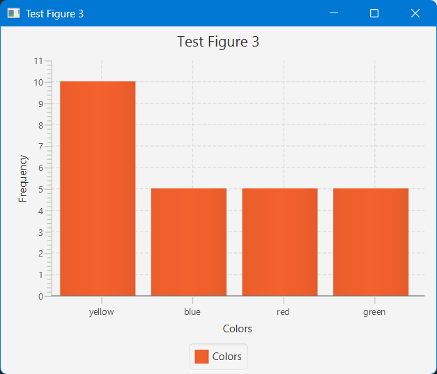

# FXPlot

FXPlot is a **simple JavaFX-based plotting library** inspired by Python's Matplotlib.  
It allows you to quickly create **line plots, scatter plots, and histograms** in Java using JavaFX.  

---

## Features

- **Line plots** (`"l"`)
- **Scatter plots** (`"s"`)
- **Histograms** (`"h"`)
- Automatic **JavaFX runtime initialization**
- Easy API for adding numeric or categorical data
- Series labeling in charts
- Each call to `figure.show()` opens a **new window**

---

## Project Structure

```
fxplot/
├── src/main/java/io/github/rajveer/fxplot/
│ └── Figure.java # Main plotting class
├── pom.xml # Maven project file
└── README.md # This file
```


---

## Usage

### Line Plot

```java
import io.github.rajveer.fxplot.Figure;
import java.util.*;

public class Main {
    public static void main(String[] args) {
        Figure figure1 = new Figure("Test Figure 1", "l"); // "l" = line plot
        figure1.setXLabel("X-axis");
        figure1.setYLabel("Y-axis");

        List<double[]> sinSeries = new ArrayList<>();
        List<double[]> cosSeries = new ArrayList<>();

        for (int t = 0; t < 100; t++) {
            sinSeries.add(new double[]{t, Math.sin(t * 0.1)});
            cosSeries.add(new double[]{t, Math.cos(t * 0.1)});
        }

        figure1.addNumericSeries("sin(t)", sinSeries);
        figure1.addNumericSeries("cos(t)", cosSeries);

        figure1.show();
    }
}
```

### Scatter Plot

```java
import io.github.rajveer.fxplot.Figure;
import java.util.*;

public class Main {
    public static void main(String[] args) {
        Figure figure2 = new Figure("Test Figure 2", "s"); // "s" = scatter plot
        figure2.setXLabel("Height");
        figure2.setYLabel("Weight");

        List<double[]> heightWeightSeries = new ArrayList<>();
        heightWeightSeries.add(new double[]{150.0, 50.0});
        heightWeightSeries.add(new double[]{160.0, 55.0});
        heightWeightSeries.add(new double[]{165.0, 62.0});
        heightWeightSeries.add(new double[]{170.0, 68.0});
        heightWeightSeries.add(new double[]{175.0, 75.0});
        heightWeightSeries.add(new double[]{180.0, 82.0});
        heightWeightSeries.add(new double[]{185.0, 90.0});
        heightWeightSeries.add(new double[]{190.0, 95.0});

        figure2.addNumericSeries("Height-Weight", heightWeightSeries);

        figure2.show();
    }
}
```

### Histogram
```java
import io.github.rajveer.fxplot.Figure;
import java.util.*;

public class Main {
    public static void main(String[] args) {
        Figure figure3 = new Figure("Test Figure 3", "h"); // "h" = histogram
        figure3.setXLabel("Colors");

        List<String> colorSeries = Arrays.asList(
            "yellow", "blue", "red", "yellow", "green", "yellow", "red",
            "blue", "yellow", "green", "red", "yellow", "blue", "yellow",
            "green", "yellow", "red", "blue", "yellow", "green", "yellow",
            "red", "blue", "yellow", "green"
        );

        figure3.addCategorySeries("Colors", colorSeries);

        figure3.show();
    }
}
```


## API Reference

| Method                                                    | Description                               |
| --------------------------------------------------------- | ----------------------------------------- |
| `setXLabel(String label)`                                 | Set the X-axis label                      |
| `setYLabel(String label)`                                 | Set the Y-axis label                      |
| `addNumericSeries(String name, List<double[]> data)`      | Add numeric series for line/scatter plots |
| `addCategorySeries(String name, List<String> categories)` | Add categorical series for histograms     |
| `show()`                                                  | Display the chart in a new JavaFX window  |

---
# FXPlot

A simple JavaFX plotting utility inspired by Matplotlib.

## Local Installation

Since FXPlot is not yet published to Maven Central, you can build and install it locally:

```bash
mvn clean install
```
Then add the dependency in your project:
```xml
<repositories>
  <repository>
    <id>jitpack.io</id>
    <url>https://jitpack.io</url>
  </repository>
</repositories>

<dependencies>
  <dependency>
    <groupId>com.github.muichi-mon</groupId>
    <artifactId>fxplot</artifactId>
    <version>master-SNAPSHOT</version>
  </dependency>
</dependencies>
```
If your project uses the Java module system, add the following line in your module-info.java:
```java
module your.module.name {
    requires io.github.rajveer.fxplot;
}
```
## ⚠️ Keep in mind:
#### FXPlot works in JavaFX projects, so make sure you have the necessary JavaFX dependencies and modules added to your project setup.
---

## 📄 License

This project is licensed under the MIT License. See the [LICENSE](LICENSE) file for details.

---
